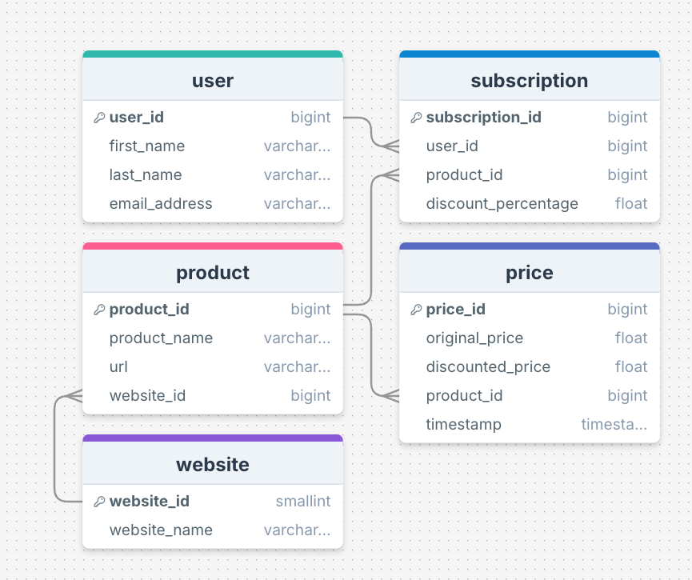

# 🗄️ The Database
This module contains the schema for the database and SQL file with test data that can be inserted into the database.

## 📋 Overview 
The database created is a PostgreSQL database, hosted on an AWS RDS instance.

## Entity Relationship Diagram



This Entity-Relationship Diagram (ERD) provides a high-level overview of the database schema, showcasing the relationships between key entities such as `users`, `products`, `websites`, `subscriptions`, `price_changes`, and `notifications_sent`. This structure has been normalised to 3NF and supports functionalities like tracking price changes, managing user subscriptions, and sending notifications for price drop events.

## 🛠️ Prerequisites
- **AWS RDS (PostgreSQL)** database running (please navigate to the `terraform-rds` subfolder within the `terraform` folder for further instructions on how to set up the database).

## ⚙️ Setup
1. Create a `.env` file and fill with the following variables:
```env
# Database Configuration
DB_HOST=<the-rds-host-address>
DB_PORT=<the-rds-port-number>
DB_NAME=<the-rds-name>
DB_USER=<the-rds-username>
DB_PASSWORD=<the-rds-password>
```

2. Initialise the database using:
```bash
bash connect.sh
```

### ✨ Using test data (**Optional**)
Fake test data on users, products, prices, and subscriptions can be used. This is useful for testing/developing the cloud architecture and dashboard structure.

Seed the database with test data using:
```bash
bash seed_test_data.sh
```

## 📁 Files
- `schema.sql` defines the database schema using SQL.
- `test_database.sql` contains fake data that can be inserted for the sake of testing and validation.
- `connect.sh` can be used to connect to the database.
- `seed_test_data.sh` is used to seed the database with test data.