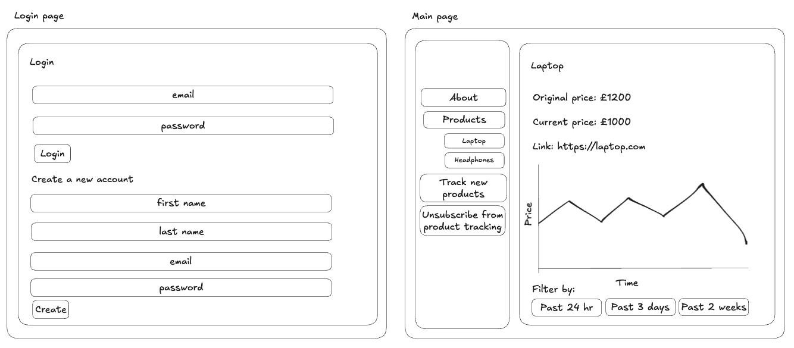

# 💸 Price Slashers Dashboard

## 📋 Overview

This module hosts the Price Slashers dashboard. This dashboard showcases trends on product prices over time, along with their original and discounted prices. 

## Initial Dashboard Wireframe



The wireframe outlines the initial design of the dashboard. It includes a login page for user authentication and account creation, and a main page where users can view product price trends, track new products, unsubscribe from tracking, and filter data by time ranges. This layout provides an intuitive and functional interface for managing and visualizing product price tracking.

## 🛠️ Prerequisites

- **ECS Service** deployed from running [Terraform](../terraform/terraform-dashboard-ecs/README.md)
- **ECR Repository** created from running [Terraform](../terraform/terraform-dashboard-ecr/README.md)

Optional:
- **Python** installed (for running the dashboard locally)

## ⚙️ Setup 

Create a `.env` file with the following environment variables:
```env
# Database Configuration
DB_USER=<the-rds-username>
DB_PASSWORD=<the-rds-password>
DB_NAME=<the-rds-name>
DB_PORT=<the-rds-port>
DB_HOST=<the-rds-host-address>
```

### 💻 Running Locally (MacOS, **Optional**)

The dashboard can also be ran locally by:

1. Creating and activating a virtual environment:
```bash
python3 -m venv venv
source venv/bin/activate
```

2. Installing requirements:
```bash
pip install -r requirements.txt
```

3. Running the dashboard:
```bash
streamlit run dashboard.py
```

## 📁 Files

- `dashboard.py`: The main file that runs the dashboard. This contains all the pages displayed using `streamlit_option_menu`
- `database_connection.py`: Useful functions for connecting to the database.
