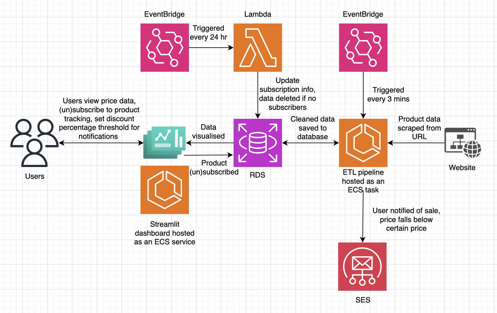

# ☁️ Cloud Deployment using Terraform

The project is designed to be deployed on the cloud using AWS services via Terraform.

## Architecture Diagram



The architecture diagram showcases the integration of AWS services like ECS, RDS, Lambda, and SES. Users interact via a Streamlit dashboard to track product prices and set notifications. An ETL pipeline scrapes and cleans product data, before storing it in an RDS database. EventBridge triggers automated tasks like data updates and email notifications for price drops, ensuring a seamless and scalable workflow.

## 🛠️ Prerequisites
- **Terraform** installed
- **AWS CLI** downloaded

## ⚙️ Setup
1. Install AWS CLI on your machine. You can find more information at [this link](https://docs.aws.amazon.com/cli/latest/userguide/getting-started-install.html)
2. Run the command:
    ```bash
    aws configure
    ```
Follow the prompts to enter your AWS credentials.

## 📝 Important Notes and Next Steps

- Remember to add any `*.env` and `*.tfvars` files to gitignore if not already listed.
- Please navigate to the other Terraform subfolders for more detailed instructions in the respective READMEs on how to set up and take down various parts of the cloud infrastructure.